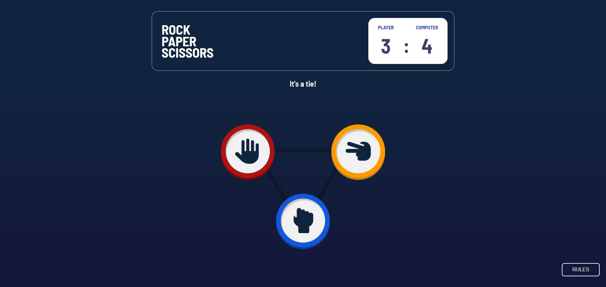

## Table of contents

- [Overview](#overview)
  - [The challenge](#the-challenge)
  - [Screenshots](#screenshots)
- [My process](#my-process)
  - [Built with](#built-with)

## Overview

### The challenge

- Created a Rock, Paper, Scissors game as part of [The Odin Project](https://www.theodinproject.com), while taking design inspiration from [Frontend Mentor](https://www.frontendmentor.io)
- Live demo: https://itskharina.github.io/Rock-Paper-Scissors/

Users should be able to:

- View the optimal layout for the game depending on their device's screen size
- Play Rock, Paper, Scissors against the computer
- See their score as well as the computer's score

### Screenshots

## My process

### Built with

- Semantic HTML5 markup
- CSS (Grid and Flexbox)
- JavaScript
